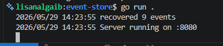

# Event Store

A small HTTP service that stores events in an append-only log and reads them back by ID, even after a restart.

## Setup

### Install & Start
```bash
go run .
```

### API Commands
```bash
# POST an event
curl -X POST http://localhost:8080/events   -H "Content-Type: application/json"   -d '{"name": "daniel", "action": "login"}'

# GET an event
curl http://localhost:8080/events/bb7769cd-9f23-464c-a3e6-3584cf000a4f

# GET stats
curl http://localhost:8080/stats
```

---

## Architecture



### How a write works
A write works by going to the end of the file using `Seek`, since it's an append-only log, then the the content is written as a string
then forcefully saved to disk with `e.file.Sync`. The write uses a mutex lock to serialize writes to prevent race conditions 

### How a read works
A read works by first checking the index to see if the event exists, then goes on to read the exact bytes for that particular index that exists since we store both offset and legnth of content in bytes.

---

## Core Concepts

### Why append-only is safer than overwriting
This is is favourble to hardware architecture i.e HDDs and SSDs, it's simply adding to the end of a file and it's a very fast operation. Overwriting on the other hand requires you to look up the position of the index first then update that place on disk, which is quite expensive.

### Why an index makes reads fast
Indexes make read fast because they provide a means to skip full scans and jump straight to the requested data.
Although they come at a tradeoff: every index can improve reads but slow down writes.

---

## Recovery


---

## What I Struggled With
Just the indexing choice, using offset and length.

---

## What I Learned
This architecture known as the Write-Ahead Log (WAL) powers every database architecture.
This thinking also translates to distributed systems where crashes can happen, one key to recovery is to record the intent to do sth before doing it. That's the idea behind the WAL, outbox pattern and so on.

---

## Resources
Designing Data-Intensive Applications - Martink Kleppman; Chapter 3 - Database Stroage Engines

---

## Why This Made Me a Better Backend Developer
Shows that understanding how things work underneath have various applications as the thinking can be applied in various ways.
